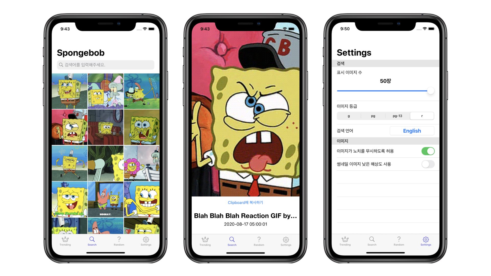

# RxGIF 

> RxSwift를 공부하기위해 개발한 GIPHY 검색 어플리케이션

## 개발 목표
RxSwift를 이용한 앱을 제작해보기로 마음먹은 상황에서 여러 예제들을 찾아보던 중, [BringMyOwnBeer](https://github.com/fimuxd/BringMyOwnBeer-) 라는 RxSwift를 사용한 MVVM 예제를 발견하였고, 유사한방식으로 _API를 이용해 재밌는 앱을 만들면서 RxSwift에 익숙해져 보는게 좋겠다_는 판단에 개발하게 되었습니다.  

## 기능
| 트렌드 | 검색 | 복사/붙여넣기 | 설정 |
|:---:|:---:|:---:|:---:|
|||||

1. 트렌드 : 현 시점 가장 트렌디한 GIF들을 확인할 수 있습니다.
2. 검색 : 키워드를 입력해 원하는 GIF를 검색할 수 있습니다.
3. 복사/붙여넣기 : 선택한 GIF를 클립보드에 복사할 수 있습니다. 이를 다른 앱 (iMessage, 카카오톡 등) 에서 붙여넣기를 통해 바로 사용할 수 있습니다.
4. 설정 : 한번에 검색되는 GIF의 수, 이미지의 퀄리티, 언어, 검색 연령을 설정할 수 있습니다.

> [GIPHY](https://developers.giphy.com/) API를 사용합니다. 

## 사용 라이브러리
+ [SnapKit](https://github.com/SnapKit/SnapKit) : Auto Layout을 코드만으로 설정할 수 있도록 도와주는 라이브러리
+ [RxSwift](https://github.com/ReactiveX/RxSwift) : 비동기, 이벤트 기반 프로그래밍 라이브러리
+ [FLAnimatedImage](https://github.com/Flipboard/FLAnimatedImage) : 움직이는 이미지를 지원하지 않는 UIImageView를 대체할 수 있는 컴포넌트
+ [Nuke](https://github.com/kean/Nuke) : FLAnimatedImage와 함께 사용 가능한 이미지 캐시
+ [NotificationBannerSwift](https://github.com/Daltron/NotificationBanner) : 상단 배너에 알림을 띄워주는 컴포넌트
+ [Hero](https://github.com/HeroTransitions/Hero) : 다양한 스타일의 View 전환 애니메이션을 제공하는 라이브러리

## To-do list
- [x] ~~GIPHY API 적용해보기~~
- [x] ~~RxSwift 사용해보기~~
- [x] ~~Storyboard를 SnapKit으로 대체해보기~~
- [x] ~~Image Cache 적용해보기~~
- [x] ~~뷰 트랜지션 적용해보기~~
- [x] ~~설정 기능 구현해보기~~
- [ ] 무한스크롤 구현해보기
- [ ] App Store 출시해보기

## TMI
[여기](https://www.notion.so/yabby/RxGIF-e2976236ff7f4e1386f95433a824f5bc) 에서 개발 로그를 확인할 수 있습니다.